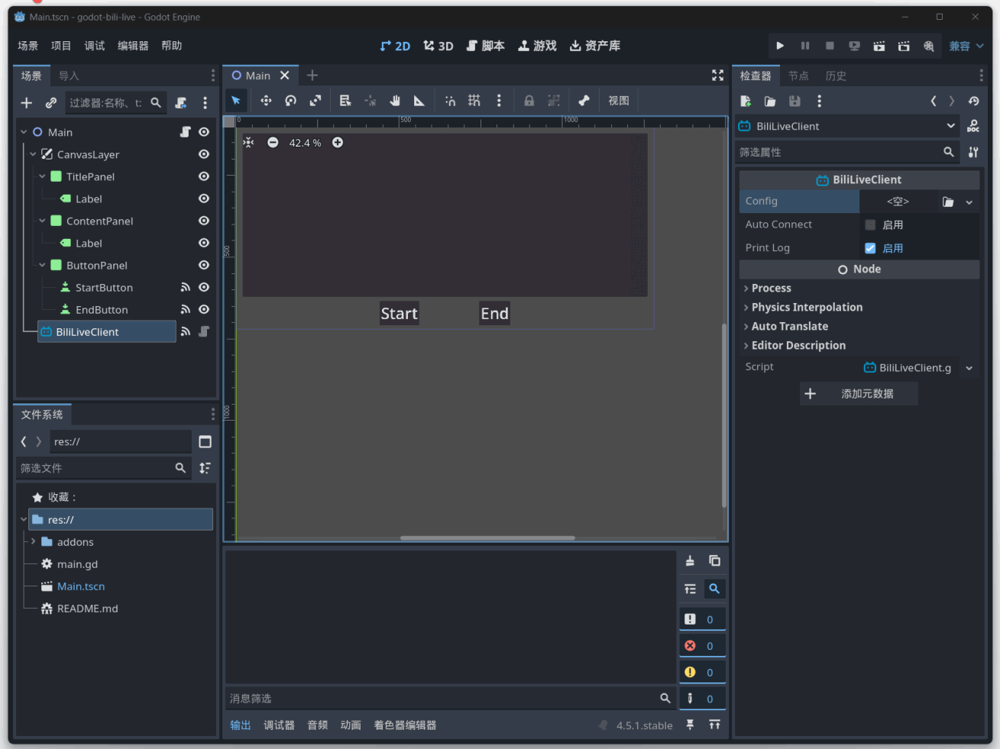

# BiliLive for Godot4.x

专为 Godot 开发的 Bilibili 直播「互动玩法」插件。支持长连接心跳维持与弹幕、礼物、交互数据的实时接收。

## 特性

- **极简接入**：基于 Node 节点和 Resource 配置，几行代码即可开启直播互动。
- **强类型实体**：所有数据（弹幕、礼物、上舰等）均封装为完善的实体类，无需解析 `Dictionary`，支持代码补全。
- **完善的注释**：每一个信号、属性、方法均附带详细的中文注释与类型定义，编辑器内即刻查阅。

## 信号

- **signal live_dm(data: BiliLiveDm)**：直播间有人发送弹幕时触发
- **signal live_dm_mirror(data: BiliLiveDmMirror)**：当该直播间为支持跨房弹幕的直播间模式，其他直播间有人发送弹幕时触发
- **signal live_send_gift(data: BiliLiveSendGift)**：当该直播间有人赠送礼物时触发
- **signal live_super_chat(data: BiliLiveSuperChat)**：当该直播间有人发送付费留言时触发
- **signal live_super_chat_del(data: BiliLiveSuperChatDel)**：当该直播间有付费留言被下线时触发
- **signal live_guard(data: BiliLiveGuard)**：当该直播间有人上舰时触发
- **signal live_like(data: BiliLiveLike)**：该直播间有用户在移动端双击直播画面点赞时触发
- **signal live_room_enter(data: BiliLiveRoomEnter)**：直播间有观众进入直播间时触发
- **signal live_live_start(data: BiliLiveLiveStart)**：该直播间开始直播时触发
- **signal live_live_end(data: BiliLiveLiveEnd)**：该直播间停止直播时触发
- **signal live_interaction_end(data: BiliLiveInteractionEnd)**：当目前长连接停止推送时触发

参考[长链命令说明](https://open-live.bilibili.com/document/f9ce25be-312e-1f4a-85fd-fef21f1637f8)

## 安装

1. 将 `addons/bili_live` 文件夹复制到你的 Godot 项目根目录下。
2. 前往 `项目` -> `项目设置` -> `插件`。
3. 勾选 `BiliLive` 并启用。

## 配置认证信息

### 使用Resource方式
在资源面板中右键 -> `新建` -> `资源` 搜索 `BiliLiveConfig` 资源文件，填入你在 [Bilibili 开放平台](https://open-live.bilibili.com/open-manage) 获取的信息。



### 编写代码方式

```gdscript
extends Node

@onready var client: BiliLiveClient = $BiliLiveClient

func _ready() -> void:
	var config := BiliLiveConfig.new()
	config.id_code = "主播身份码"
	config.app_id = 123456789
	config.access_key_id = "access_key_id"
	config.access_key_secret = "access_key_secred"
	client.config = config

	client.start()
```

---
